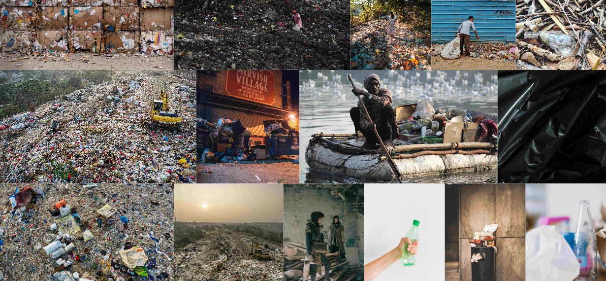

# Les architectures applicatives

## A propos

Ce dépôt contient du matériel de soutien pour le cours **HTML5 & CSS3**

## Contenu

Ce dépôt est organisé comme suit :

- Vous pouvez trouver les présentations PDF du cours ci-dessous:
- [Support du Cours](./Support%20HTML%205%20&%20CSS%203.pdf)
- [Les TPs](./TPs/)

## Exemple projets

### La Mosaïque

## Formateur

Nehemie Balukidi, [@olfredos6](https://github.com/Olfredos6)
